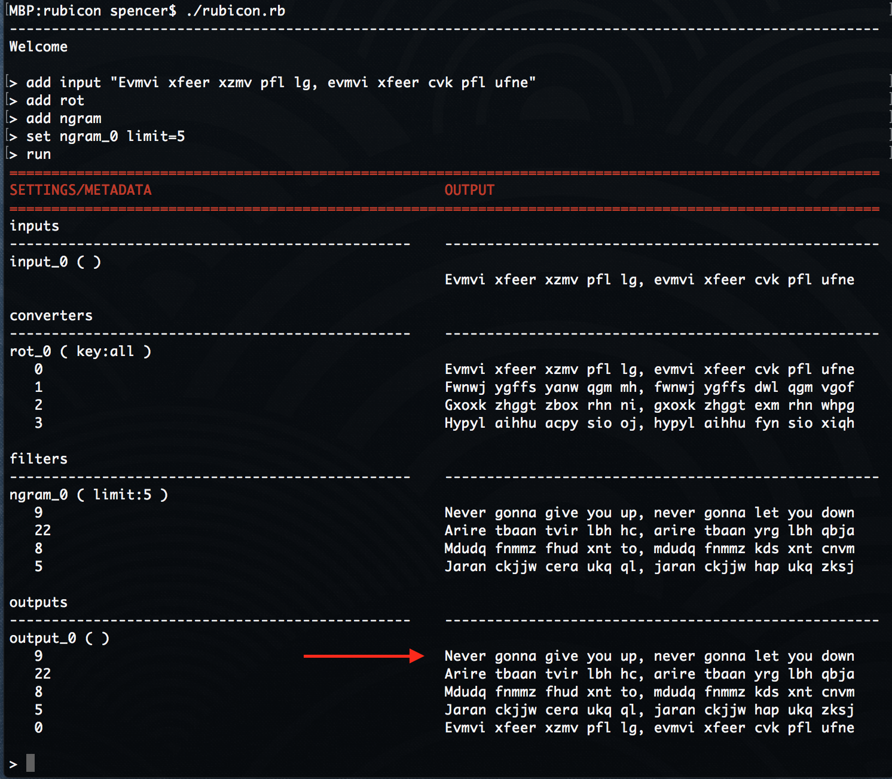

# Rubicon

This is an ongoing project to bring a modular approach to solving crypto puzzles. Ciphers, key generators, and decryption detection code can all be modularly added. Its currently a proof of concept of using an n-gram filter to score decrypted text when brute forcing ciphers.

## Usage

&#35; ruby rubicon

> add input "Evmvi xfeer xzmv pfl lg, evmvi xfeer cvk pfl ufne"

> add rot

> add ngram

> set ngram_0 limit=5

> run

## Example

Here we have automatically detected that a ROT 9 will decrypt this text.  This is a simple POC but this can be used with different ciphers and generated keys or wordlists.

## Ngram Filter

An n-gram model scores sequences of letters by how common they occur in a language. The n-gram filter used in Rubicon is an English language tri-gram. Sentences that have sequences of letters common to English will score higher than those that don't. We can take advantage of this when brute forcing ciphers by scoring all decryptions, and sorting them. Thus we have the most likely decryptions toward the top of the list.